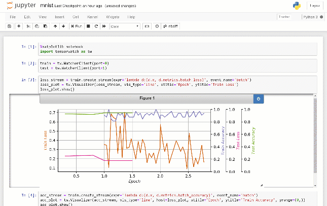
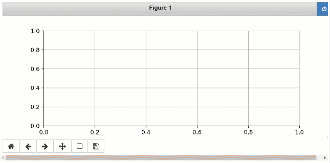
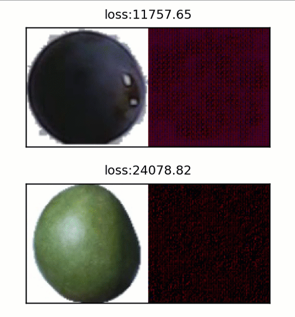
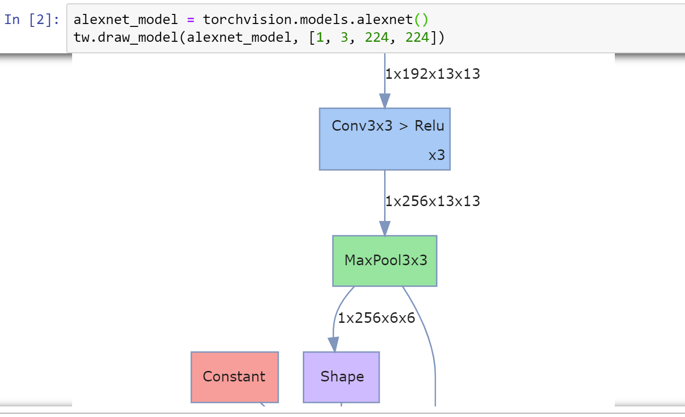
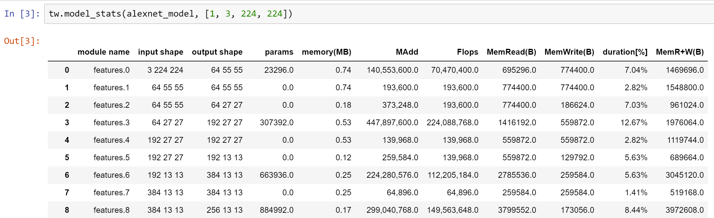
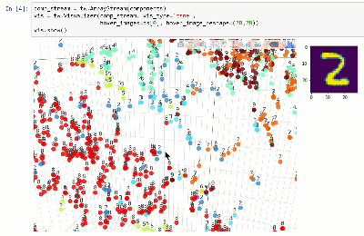
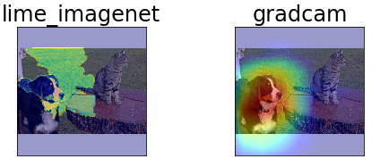

# Welcome to TensorWatch

TensorWatch is a debugging and visualization tool designed for data science, deep learning and reinforcement learning from Microsoft Research. It works in Jupyter Notebook to show real-time visualizations of your machine learning training and perform several other key analysis tasks for your models and data.

TensorWatch is designed to be flexible and extensible so you can also build your own custom visualizations, UIs, and dashboards. Besides traditional "what-you-see-is-what-you-log" approach, it also has a unique capability to execute arbitrary queries against your live ML training process, return a stream as a result of the query and view this stream using your choice of a visualizer (we call this [Lazy Logging Mode](#lazy-logging-mode])).

TensorWatch is under heavy development with a goal of providing a platform for debugging machine learning in one easy to use, extensible, and hackable package.



## How to Get It

```
pip install tensorwatch
```

TensorWatch supports Python 3.x and is tested with PyTorch 0.4-1.x. Most features should also work with TensorFlow eager tensors. TensorWatch uses graphviz to create network diagrams and depending on your platform sometime you might need to manually [install](https://graphviz.gitlab.io/download/) it.

## How to Use It

### Quick Start

Here's simple code that logs an integer and its square as a tuple every second to TensorWatch:
```
import tensorwatch as tw
import time

# streams will be stored in test.log file
w = tw.Watcher(filename='test.log')

# create a stream for logging
s = w.create_stream(name='metric1')

# generate Jupyter Notebook to view real-time streams
w.make_notebook()

for i in range(1000):
    # write x,y pair we want to log
    s.write((i, i*i))

    time.sleep(1)
```
When you run this code, you will notice a Jupyter Notebook file `test.ipynb` gets created in your script folder. From a command prompt type `jupyter notebook` and select `test.ipynb`. Choose *Cell > Run all* in the menu to see the real-time line graph as values get written in your script.

Here's the output you will see in Jupyter Notebook:



To dive deeper into the various other features, please see [Tutorials](#tutorials) and [notebooks](https://github.com/microsoft/tensorwatch/tree/master/notebooks).

### How does this work?

When you write to a TensorWatch stream, the values get serialized and sent to a TCP/IP socket as well as the file you specified. From Jupyter Notebook, we load the previously logged values from the file and then listen to that TCP/IP socket for any future values. The visualizer listens to the stream and renders the values as they arrive.

Ok, so that's a very simplified description. The TensorWatch architecture is actually much more powerful. Almost everything in TensorWatch is a *stream*. Files, sockets, consoles and even visualizers are streams themselves. A cool thing about TensorWatch streams is that they can listen to any other streams. This allows TensorWatch to create a *data flow graph*. This means that a visualizer can listen to many streams simultaneously, each of which could be a file, a socket or some other stream. You can recursively extend this to build arbitrary data flow graphs. TensorWatch decouples streams from how they get stored and how they get visualized.

## Visualizations
In the above example, the line graph is used as the default visualization. However, TensorWatch supports many other diagram types including histograms, pie charts, scatter charts, bar charts and 3D versions of many of these plots. You can log your data, specify the chart type you want and let TensorWatch take care of the rest.

One of the significant strengths of TensorWatch is the ability to combine, compose, and create custom visualizations effortlessly. For example, you can choose to visualize an arbitrary number of streams in the same plot. Or you can visualize the same stream in many different plots *simultaneously*. Or you can place an arbitrary set of visualizations side-by-side. You can even create your own custom visualization widget simply by creating a new Python class, implementing a few methods.

## Comparing Results of Multiple Runs
Each TensorWatch stream may contain a metric of your choice. By default, TensorWatch saves all streams in a single file, but you could also choose to save each stream in separate files or not to save them at all (for example, sending streams over sockets or into the console directly, zero hit to disk!). Later you can open these streams and direct them to one or more visualizations. This design allows you to quickly compare the results from your different experiments in your choice of visualizations easily.

## Training within Jupyter Notebook
Often you might prefer to do data analysis, ML training, and testing - all from within Jupyter Notebook instead of from a separate script. TensorWatch can help you do sophisticated, real-time visualizations effortlessly from code that is run within a Jupyter Notebook end-to-end.

## Lazy Logging Mode
A unique feature in TensorWatch is the ability to query the live running process, retrieve the result of this query as a stream and direct this stream to your preferred visualization(s). You don't need to log any data beforehand. We call this new way of debugging and visualization a *lazy logging mode*.

For example, as seen below, we visualize input and output image pairs, sampled randomly during the training of an autoencoder on a fruits dataset. These images were not logged beforehand in the script. Instead, the user sends query as a Python lambda expression which results in a stream of images that gets displayed in the Jupyter Notebook:



See [Lazy Logging Tutorial](https://github.com/microsoft/tensorwatch/blob/master/docs/lazy_logging.md).

### Pre-Training and Post-Training Tasks

TensorWatch leverages several excellent libraries including [hiddenlayer](https://github.com/waleedka/hiddenlayer), [torchstat](https://github.com/Swall0w/torchstat), [Visual Attribution](https://github.com/yulongwang12/visual-attribution) to allow performing the usual debugging and analysis activities in one consistent package and interface.

For example, you can view the model graph with tensor shapes with a one-liner:



You can view statistics for different layers such as flops, number of parameters, etc:



[See notebook](https://github.com/microsoft/tensorwatch/blob/master/notebooks/network_arch.ipynb).

You can view the dataset in a lower dimensional space using techniques such as t-SNE:



[See notebook](https://github.com/microsoft/tensorwatch/blob/master/notebooks/data_exploration.ipynb).

### Prediction Explanations
We wish to provide various tools for explaining predictions to help debugging models. Currently, we offer several explainers for convolutional networks, including [Lime](https://github.com/marcotcr/lime). For example, the following highlights the areas that cause the Resnet50 model to make a prediction for class 240 for the Imagenet dataset:



[See notebook](https://github.com/microsoft/tensorwatch/blob/master/notebooks/cnn_pred_explain.ipynb).


## Tutorials

- [Simple Logging Tutorial](https://github.com/microsoft/tensorwatch/blob/master/docs/simple_logging.md)

- [Lazy Logging Tutorial](https://github.com/microsoft/tensorwatch/blob/master/docs/lazy_logging.md)

- [Using TensorWatch for Deep Learning Training (MNIST)](https://github.com/microsoft/tensorwatch/blob/master/notebooks/mnist.ipynb)

- [Using TensorWatch for Deep Learning Training (Food360)](https://github.com/microsoft/tensorwatch/blob/master/notebooks/fruits_analysis.ipynb)

- [Exploring Data Using T-SNE](https://github.com/microsoft/tensorwatch/blob/master/notebooks/data_exploration.ipynb)

- [Predication Explainers for Convolutional Neural Networks](https://github.com/microsoft/tensorwatch/blob/master/notebooks/cnn_pred_explain.ipynb)

- [Viewing Model Graph and Statistics](https://github.com/microsoft/tensorwatch/blob/master/notebooks/network_arch.ipynb)

## Paper

More technical details are available in [TensorWatch paper (EICS 2019 Conference)](https://arxiv.org/abs/2001.01215). Please cite this as:

```
@inproceedings{tensorwatch2019eics,
  author    = {Shital Shah and Roland Fernandez and Steven M. Drucker},
  title     = {A system for real-time interactive analysis of deep learning training},
  booktitle = {Proceedings of the {ACM} {SIGCHI} Symposium on Engineering Interactive
               Computing Systems, {EICS} 2019, Valencia, Spain, June 18-21, 2019},
  pages     = {16:1--16:6},
  year      = {2019},
  crossref  = {DBLP:conf/eics/2019},
  url       = {https://arxiv.org/abs/2001.01215},
  doi       = {10.1145/3319499.3328231},
  timestamp = {Fri, 31 May 2019 08:40:31 +0200},
  biburl    = {https://dblp.org/rec/bib/conf/eics/ShahFD19},
  bibsource = {dblp computer science bibliography, https://dblp.org}
}
```

## Contribute

We would love your contributions, feedback, questions, and feature requests! Please [file a Github issue](https://github.com/microsoft/tensorwatch/issues/new) or send us a pull request. Please review the [Microsoft Code of Conduct](https://opensource.microsoft.com/codeofconduct/) and [learn more](https://github.com/microsoft/tensorwatch/blob/master/CONTRIBUTING.md).

## Contact

Join the TensorWatch group on [Facebook](https://www.facebook.com/groups/378075159472803/) to stay up to date or ask any questions.

## Credits

TensorWatch utilizes several open source libraries for many of its features. These includes: [hiddenlayer](https://github.com/waleedka/hiddenlayer), [torchstat](https://github.com/Swall0w/torchstat), [Visual-Attribution](https://github.com/yulongwang12/visual-attribution), [pyzmq](https://github.com/zeromq/pyzmq), [receptivefield](https://github.com/fornaxai/receptivefield), [nbformat](https://github.com/jupyter/nbformat). Please see `install_requires` section in [setup.py](setup.py) for upto date list.

## License

This project is released under the MIT License. Please review the [License file](LICENSE.txt) for more details.
