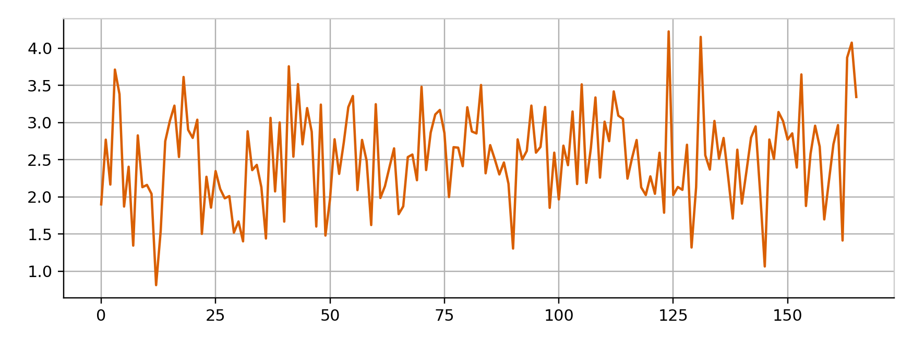

# Lazy Logging Tutorial

In this tutorial, we will use a straightforward script that creates an array of random numbers. Our goal is to examine this array from the Jupyter Notebook while below script is running separately in a console.

```
# available in test/simple_log/sum_lazy.py

import time, random
import tensorwatch as tw

# create watcher object as usual
w = tw.Watcher()

weights = None
for i in range(10000):
    weights = [random.random() for _ in range(5)]

    # let watcher observe variables we have
    # this has almost no performance cost
    w.observe(weights=weights)

    time.sleep(1)
```

## Basic Concepts

Notice that we give `Watcher` object an opportunity to *observe* variables. Observing variables is very cheap so we can observe anything that we might be interested in, for example, an entire model or a batch of data. From the Jupyter Notebook, you can specify arbitrary *lambda expression* that we execute in the context of these observed variables. The result of this lambda expression is sent as stream back to Jupyter Notebook so that you can render into visualizer of your choice. That's pretty much it. 

## How Does This Work?

TensorWatch has two core classes: `Watcher` and `WatcherClient`. The `Watcher` object will open up TCP/IP sockets by default and listens to any incoming requests. The `WatcherClient` allows you to connect to `Watcher` and have it execute any Python [lambda expression](http://book.pythontips.com/en/latest/lambdas.html) you want. The Python lambda expressions consume a stream of values as input and outputs another stream of values. The lambda expressions may typically contain [map, filter, and reduce](http://book.pythontips.com/en/latest/map_filter.html) so you can transform values in the input stream, filter them, or aggregate them. Let's see all these with a simple example.

## Create the Client
You can either create a Jupyter Notebook or get the existing one in the repo at `notebooks/lazy_logging.ipynb`. 

Let's first do imports:


```python
%matplotlib notebook
import tensorwatch as tw
```

Next, create a stream using a simple lambda expression that sums values in our `weights` array that we are observing in the above script. The input to the lambda expression is an object that has all the variables we are observing.

```python
client = tw.WatcherClient()
stream = client.create_stream(expr='lambda d: np.sum(d.weights)')
```
 
Next, send this stream to line chart visualization:

```python
line_plot = tw.Visualizer(stream, vis_type='line')
line_plot.show()
```

Now when you run our script `sum_lazy.py` in the console and then above Jupyter Notebook, you will see the sum of `weights` array getting plotted in real-time:



## What Just Happened?

Notice that your script is running in a different process than Jupyter Notebook. You could have been running your Jupyter Notebook on your laptop while your script could have been in some VM in a cloud. You can do queries on observed variables at the run-time! As `Watcher.observe()` is a cheap call, you could observe your entire model, batch inputs and outputs, and so on. You can then slice and dice all these observed variables from the comfort of your Jupyter Notebook while your script is progressing!

## Next Steps

We have just scratched the surface in this new land of lazy logging! You can do much more with this idea. For example, you can create *events* so your lambda expression gets executed only on those events. This is useful to create streams that generate data per batch or per epoch. You can also use many predefined lambda expressions that allows you to view top k by some criteria.

## Questions?

File a [Github issue](https://github.com/microsoft/tensorwatch/issues/new) and let us know if we can improve this tutorial.
