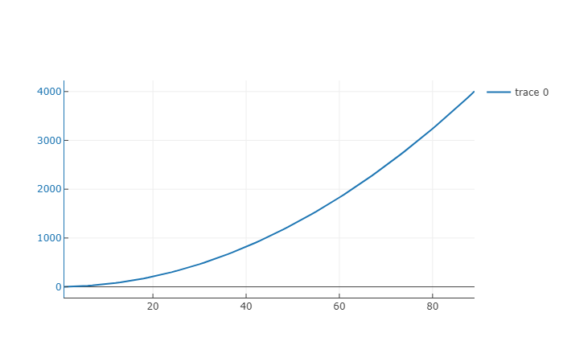

# Welcome to the Simple Logging Tutorial

We would start by running the script [sum_log.py](https://github.com/microsoft/tensorwatch/blob/master/test/simple_log/sum_log.py) available at `test/simple_log` directory. This is just simple code that just sums N numbers. We added couple of TensorWatch statements to log the values we want. Now while this script is running, you can execute this notebook ([download it here](https://github.com/microsoft/tensorwatch/blob/master/notebooks/simple_logging.ipynb)).


```python
%matplotlib notebook
import tensorwatch as tw
```

First we create client that would connect to the Watcher running in out script. By default connection is made over TCP/IP sockets. We then specify the name of the log stream that we had created in the script.


```python
client = tw.WatcherClient()
stream = client.open_stream('my_log')
```

Now lets visualize this stream in text format.


```python
text_vis = tw.Visualizer(stream, vis_type='text')
text_vis.show()
```


That worked out good! How about feeding same stream to line chart visualization?


```python
line_plot = tw.Visualizer(stream, vis_type='line')
line_plot.show()
```


Ooo... Now we have two simultaneous visualizations running in Jupyter Notebook in real-time fed from same stream! How about adding one more? This time we want to see real-time statistics of the values coming in our stream. Oh, BTW, we had also like to see next to our text visualization above so we set the cell parameter like this:


```python
summary = tw.Visualizer(stream, vis_type='summary', cell=text_vis)
```


TensorWatch allows many different frameworks for visualizations. You can build your custom ones also fairly easily. Here let's see our stream visualized using Plotly library:


```python
plotly_line = tw.Visualizer(stream, vis_type='plotly-line')
plotly_line.show()
```



